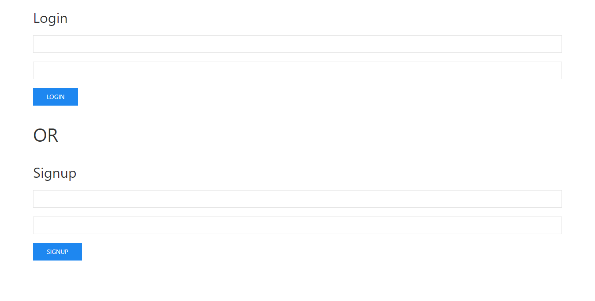
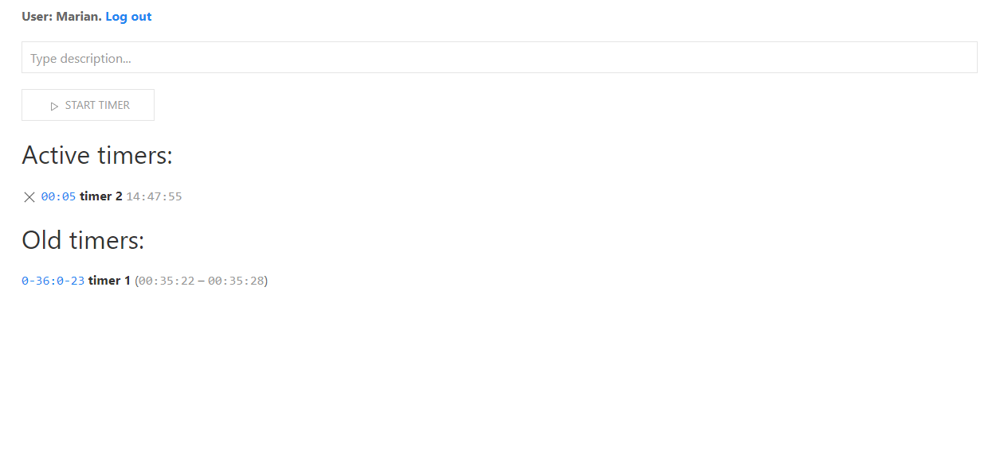

# Timers ws app
A simple timers app that uses web sockets and SQLite3 database
to save the results of timers. Also there is the opportunity to
signup and login which means that several users can use this app





## Important point
To avoid the conflict between Vue and Nunjucks syntaxes the latest is
configured so that square brackets are used instead of curly braces
for server-side templates:

```js
  tags: {
    blockStart: "[%",
    blockEnd: "%]",
    variableStart: "[[",
    variableEnd: "]]",
    commentStart: "[#",
    commentEnd: "#]",
  },
```

## Setup
```
$ npm install
$ npm run start
```

## Author
Marian Roshchupkin &lt;roshchupkin.marian@gmail.com&gt;

Updated on: 29 April 2023

## License
Apache - see [LICENSE](LICENSE)
